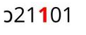

# เอกสารความต้องการระบบ (System Requirements Specification)
## ระบบรับสมัครนักเรียนเข้าโครงการ พสวท. สู่ความเป็นเลิศ ศูนย์โรงเรียนเบญจมราชูทิศ

เอกสารฉบับนี้กำหนดรายละเอียดและเงื่อนไขความต้องการในการพัฒนาระบบคอมพิวเตอร์สำหรับการรับสมัครนักเรียนเข้าศึกษาต่อในโครงการ พสวท. สู่ความเป็นเลิศ ระดับมัธยมศึกษาตอนปลาย ศูนย์โรงเรียนเบญจมราชูทิศ 

เนื่องจากกระบวนการรับสมัครและการคัดเลือกจำเป็นต้องมีความถูกต้องและแม่นยำทางข้อมูลในระดับสูงสุด การทำงานของระบบจึงออกแบบโดยใช้รูปแบบ **การตรวจสอบข้อมูลแบบประสานความร่วมมือระหว่างมนุษย์และระบบอัตโนมัติ (Human-in-the-Loop Validation)** เพื่อให้เจ้าหน้าที่ผู้รับผิดชอบสามารถตรวจสอบและอนุมัติความถูกต้องของข้อมูลจากหลักฐานจริงอีกครั้งก่อนการประมวลผลรอบถัดไป

---

## 1. คุณสมบัติและฟังก์ชันการทำงานหลักของระบบ (Core Features)

*   **ระบบการลงทะเบียนและกรอกข้อมูลออนไลน์ (Applicant Registration Form):** อำนวยความสะดวกให้ผู้สมัครสามารถลงทะเบียน กรอกรายละเอียดประวัติส่วนบุคคล ผลการเรียน และอัปโหลดหลักฐานเอกสารที่กำหนดผ่านระบบเครือข่ายอินเทอร์เน็ต
*   **ระบบประเมินเกณฑ์คุณสมบัติเบื้องต้นอัตโนมัติ (Automatic Qualification Validation):** ระบบจะดำเนินการคำนวณและประเมินสิทธิ์ของผู้สมัครทันทีในระหว่างการกรอกข้อมูล หากผลการเรียนเฉลี่ยรายวิชาหรือผลการเรียนสะสมรวม (GPAX) ต่ำกว่าเกณฑ์ที่กำหนด ระบบจะแสดงผลการประเมิน (Validation Alert) เป็นสัญลักษณ์สีแดง/เขียว พร้อมอนิเมชั่นแนะนำผู้สมัครก่อนยืนยันการส่งใบสมัคร
*   **ระบบแนะนำรหัสรายวิชาเพื่อป้องกันความผิดพลาด (Core Subject Input Guidance):** แสดงคู่มือและคำแจ้งเตือนพร้อมรูปภาพอย่างชัดเจนในจุดที่ผู้สมัครจะกรอกข้อมูลเกรดเฉลี่ยรายวิชาสะสม เพื่อแนะนำวิธีการสังเกตและพิจารณาเลือกกรอกเฉพาะ **"รายวิชาบังคับพื้นฐาน"** (ตัวเลขหลักที่ 3 ของรหัสวิชาต้องเป็นเลข 1) ซึ่งเป็นขั้นตอนที่สำคัญสูงสุด
*   **ระบบตรวจสอบและอนุมัติข้อมูลโดยเจ้าหน้าที่ (Human-in-the-Loop Verification):** หน้าจอจัดการสำหรับผู้ดูแลระบบหรือเจ้าหน้าที่รับสมัครในการเปรียบเทียบข้อมูลที่กรอกกับไฟล์เอกสารหลักฐาน และมีสิทธิ์ในการปรับปรุงแก้ไขเกรดเฉลี่ยให้ถูกต้องตามเอกสารจริงได้ทันที

---

## 2. สถานะการสมัครในระบบ (Application Statuses)

ใบสมัครในระบบจะแบ่งสถานะการดำเนินงานออกเป็น 4 ระดับอย่างเป็นทางการ ดังต่อไปนี้:

| สถานะ (Status) | คำอธิบายรายละเอียด |
| :--- | :--- |
| **แบบร่าง (Draft)** | อยู่ในระหว่างขั้นตอนการบันทึกข้อมูลของผู้สมัคร ข้อมูลยังไม่ถูกส่งเข้าระบบและผู้สมัครสามารถแก้ไขข้อมูลได้ทุกส่วน |
| **ยื่นใบสมัครแล้ว (Submitted)** | ผู้สมัครตรวจสอบและกดยืนยันการส่งข้อมูลเรียบร้อยแล้ว ใบสมัครถูกจัดส่งเข้าสู่ฐานข้อมูลระบบเพื่อรอเจ้าหน้าที่ตรวจสอบเอกสาร |
| **ผ่านการตรวจสอบ (Approved)** | เจ้าหน้าที่ดำเนินการตรวจสอบข้อมูลใบสมัครและเอกสารแนบ (ปพ.1 และบัตรประชาชน) เรียบร้อยแล้ว พบว่าข้อมูลถูกต้องและผ่านเกณฑ์คุณสมบัติครบถ้วน |
| **ส่งกลับเพื่อแก้ไข (Rejected)** | เจ้าหน้าที่ดำเนินการส่งใบสมัครกลับคืนไปยังผู้สมัคร พร้อมทั้งแจ้งรายละเอียดข้อผิดพลาดอย่างชัดเจน เพื่อให้ผู้สมัครดำเนินการแก้ไขข้อมูลและอัปโหลดเอกสารใหม่ให้ถูกต้อง สถานะนี้ไม่ใช่การตัดสิทธิ์ถาวร |

เมื่อเจ้าหน้าที่ปิดรับสมัคร ระบบต้องล็อกการแก้ไขจากฝั่งผู้สมัครทั้งหมดโดยเปลี่ยนช่วงการทำงานเข้าสู่สถานะปิดรับสมัคร (Application Closed) จากนั้นการ lock edit, ranking และ export ต้องเป็นคำสั่งแบบ manual ที่เจ้าหน้าที่กดเองผ่านหน้าจัดการ เพื่อให้มีอิสระในการตรวจสอบและควบคุมลำดับงานจริง

---

## 3. ข้อมูลและเอกสารที่ต้องการจากผู้สมัคร (Information & Document Requirements)

ผู้สมัครรับการคัดเลือกเข้าโครงการต้องระบุและนำเข้าข้อมูลและหลักฐานดังต่อไปนี้เข้าสู่ระบบ:

*   **ข้อมูลส่วนบุคคลและข้อมูลติดต่อ:**
    *   คำนำหน้านาม
    *   ชื่อ - นามสกุล
    *   เลขประจำตัวประชาชน (พร้อมระบบตรวจสอบความถูกต้องของเลขบัตรประชาชน 13 หลัก)
    *   ลำดับรายชื่อตามประกาศผลการสอบรอบแรกของโครงการ พสวท. (สำหรับใช้อ้างอิงการเชื่อมโยงข้อมูลคะแนน)
    *   ที่อยู่ตามทะเบียนบ้าน/ที่อยู่ปัจจุบัน (เลขที่, หมู่ที่, ซอย, ถนน, ตำบล/แขวง, อำเภอ/เขต, จังหวัด, รหัสไปรษณีย์)
    *   ที่อยู่อีเมล (Email Address)
    *   หมายเลขโทรศัพท์มือถือของผู้สมัคร
    *   หมายเลขโทรศัพท์มือถือของผู้ปกครอง
*   **ข้อมูลการศึกษาในปัจจุบัน:**
    *   ปัจจุบันกำลังศึกษาอยู่ในชั้นมัธยมศึกษาปีที่ 3 หรือเทียบเท่า (ระบุ: ชื่อโรงเรียนต้นสังกัด และจังหวัดที่โรงเรียนตั้งอยู่)
*   **ข้อมูลผลการเรียนสะสม 5 ภาคเรียน (ชั้น ม.1 - ม.2 เต็มปีการศึกษา และชั้น ม.3 ภาคเรียนที่ 1):**
    *   ผลการเรียนเฉลี่ยสะสมรวมทุกกลุ่มสาระการเรียนรู้ (GPAX)
    *   ข้อมูลผลการเรียนแยกตามภาคเรียนและหน่วยกิตของกลุ่มสาระการเรียนรู้คณิตศาสตร์ (วิชาพื้นฐาน), กลุ่มสาระการเรียนรู้วิทยาศาสตร์และเทคโนโลยี (วิชาพื้นฐาน), และกลุ่มสาระการเรียนรู้ภาษาต่างประเทศ (วิชาภาษาอังกฤษพื้นฐาน) เพื่อให้ระบบทำการประมวลผลคะแนนเกรดเฉลี่ยสะสมรายวิชาโดยอัตโนมัติ
*   **เอกสารหลักฐานประกอบการรับสมัคร (อัปโหลดเข้าสู่ระบบ):**
    *   รูปถ่ายสีหน้าตรงในเครื่องแบบนักเรียน (ชุดนักเรียนของโรงเรียนต้นสังกัดเดิม) ไม่สวมหมวก ไม่สวมแว่นตาดำ โดยเป็นรูปถ่ายปัจจุบันสำหรับใช้ติดใบสมัคร (รองรับรูปแบบไฟล์ PDF หรือไฟล์รูปภาพ)
    *   เอกสารสำเนาระเบียนแสดงผลการเรียน (ปพ.1) ทั้งด้านหน้าและด้านหลัง พร้อมลงลายมือชื่อรับรองสำเนาถูกต้อง (รองรับรูปแบบไฟล์ PDF หรือไฟล์รูปภาพความละเอียดสูง)
    *   เอกสารสำเนาบัตรประจำตัวประชาชนของผู้สมัคร พร้อมลงลายมือชื่อรับรองสำเนาถูกต้อง (รองรับรูปแบบไฟล์ PDF หรือไฟล์รูปภาพ)

---

## 4. ข้อมูลคะแนนสอบจากแหล่งข้อมูลภายนอก (External Data Imports via Excel)

ในการจัดทำ Ranking ระบบจะทำการนำเข้าไฟล์ฐานข้อมูลคะแนนสอบรอบแรกจากไฟล์ Excel ของโครงการ พสวท. ซึ่งประกอบด้วยข้อมูลคอลัมน์ดังนี้:
1.  เลขประจำตัวสอบรอบแรก
2.  ลำดับรายชื่อตามประกาศผลการสอบรอบแรกของโครงการ พสวท.
3.  คะแนนผลการสอบวิชาคณิตศาสตร์รอบแรก
4.  คะแนนผลการสอบวิชาวิทยาศาสตร์รอบแรก

### 🔗 การเชื่อมโยงฐานข้อมูลภายนอก (External Data Matching)
ระบบจะทำการจับคู่และเชื่อมโยงข้อมูลผู้สมัครที่กรอกข้อมูลออนไลน์ เข้ากับข้อมูลคะแนนสอบรอบแรกในไฟล์ Excel โดยอ้างอิงจาก **ลำดับรายชื่อตามประกาศผลการสอบรอบแรกของโครงการ พสวท.** ที่ผู้สมัครเป็นผู้ระบุในใบสมัครเท่านั้น โดยระบบต้องตรวจสอบว่าลำดับดังกล่าวมีอยู่ในไฟล์นำเข้า ไม่ซ้ำกับใบสมัครอื่น และแจ้งเตือนเจ้าหน้าที่หากพบลำดับที่ไม่สามารถจับคู่ได้

---

## 5. คำปฏิญาณและข้อตกลงในการส่งใบสมัคร (Applicant Declaration & Agreements)

ก่อนดำเนินการกดยืนยันส่งใบสมัครเข้าระบบ ผู้สมัครทุกคนต้องกดยอมรับคำรับรองและปฏิญาณตนตามข้อความกฎหมายการรับสมัครดังต่อไปนี้:

> "ข้าพเจ้ามีความประสงค์ยื่นใบสมัครเพื่อคัดเลือกเข้าเรียนในโครงการห้องเรียน พสวท. (สู่ความเป็นเลิศ) ปีการศึกษา 2569 ศูนย์โรงเรียนเบญจมราชูทิศ และข้าพเจ้าขอรับรองว่าข้อมูลที่ข้าพเจ้ากรอกลงในใบสมัครนี้เป็นความจริงทุกประการ ทั้งนี้หากตรวจสอบพบว่าข้าพเจ้ากรอกข้อมูลที่ไม่ถูกต้องตามความเป็นจริง และ/หรือ เป็นผู้มีคุณสมบัติไม่เป็นไปตามประกาศรับสมัคร ให้ถือว่าการสมัครคัดเลือกครั้งนี้เป็นโมฆะ และให้ถือว่าข้าพเจ้าเป็นผู้ที่ไม่มีสิทธิ์เข้ารับการคัดเลือกครั้งนี้"

---

## 6. เกณฑ์และวิธีการบันทึกผลการเรียนเฉลี่ยสะสม (Grading System & Calculation Guidelines)

*   **เกรดเฉลี่ยสะสมรวมทุกวิชา (GPAX):** ผู้สมัครสามารถนำตัวเลขเกรดเฉลี่ยสะสมรวม 5 ภาคเรียนจากระเบียนแสดงผลการเรียน ปพ.1 (ด้านหลังเอกสาร) มากรอกใส่ช่องข้อมูลได้โดยตรง
*   **เกรดเฉลี่ยรายวิชาสะสม (เฉพาะวิชาบังคับพื้นฐาน):**
    เนื่องจากระเบียนแสดงผลการเรียน ปพ.1 ไม่ได้คำนวณและแสดงเกรดเฉลี่ยสะสมแยกตามกลุ่มสาระวิชาพื้นฐานให้โดยตรง ระบบจึงออกแบบให้ผู้สมัครป้อนข้อมูลแยกตามรายวิชาในแต่ละเทอม (รวม 5 ภาคเรียน) เพื่อให้ระบบทำการประมวลผลคะแนนเกรดเฉลี่ยถ่วงน้ำหนักโดยอัตโนมัติ 
    **รายละเอียดข้อมูลผลการเรียนที่ต้องระบุประกอบด้วย:**
    1.  รหัสวิชา (เช่น ค21101, ว21101, อ21101)
    2.  ชื่อรายวิชา
    3.  จำนวนหน่วยกิตของรายวิชานั้น ๆ ในภาคเรียนนั้น ๆ
    4.  ผลการเรียนที่ได้รับ (เกรด) ของรายวิชานั้น ๆ ในภาคเรียนนั้น ๆ

> [!IMPORTANT]
> **⚠️ ประกาศเตือนและข้อควรระวังสำคัญที่สุดในการเลือกกรอกผลการเรียน (จุดที่พบข้อผิดพลาดบ่อยครั้ง):**
> ผู้สมัครจะต้องเลือกกรอกข้อมูลเกรดเฉลี่ยและหน่วยกิตเฉพาะ **"รายวิชาบังคับพื้นฐาน"** เท่านั้น ห้ามนำวิชาเพิ่มเติมหรือวิชาเลือกเสรีมากรอกอย่างเด็ดขาด!
> * **วิธีการสังเกตรายวิชาบังคับพื้นฐาน:** ให้ตรวจสอบที่ **ตัวเลขหลักที่ 3 ของรหัสวิชา** จะต้องแสดงผลเป็นตัวเลข **1** เสมอ (เช่น ว21**1**01) ดังแสดงรายละเอียดตามรูปภาพประกอบด้านล่างนี้
> * หากตัวเลขหลักที่ 3 ของรหัสวิชาแสดงเป็นตัวเลขอื่น (เช่น ตัวเลข 2 ใน ว21201 ซึ่งเป็นวิชาเพิ่มเติม) **ห้าม** นำรหัสวิชาและเกรดนี้มาบันทึกในระบบโดยเด็ดขาด หากป้อนข้อมูลไม่ถูกต้องตามเกณฑ์ประกาศรับสมัครการสมัครคัดเลือกจะถูกพิจารณาเป็นโมฆะ
> 
> 

*   **สูตรการคำนวณผลการเรียนถ่วงน้ำหนักโดยอัตโนมัติ (Weighted Grade Point Average Calculation):**
    $$\text{ผลการเรียนเฉลี่ยสะสมรายวิชา} = \frac{\sum (\text{เกรดที่ได้ในภาคเรียนนั้น} \times \text{หน่วยกิตของภาคเรียนนั้น})}{\sum \text{หน่วยกิตสะสมทั้งหมดของวิชานั้นใน 5 ภาคเรียน}}$$

    ผลลัพธ์ของ GPAX และเกรดเฉลี่ยรายวิชาที่ใช้แสดงผล ตรวจคุณสมบัติ และจัดอันดับ ต้องปัดเป็นทศนิยม 2 ตำแหน่งด้วยกฎมาตรฐานแบบ "ต่ำกว่า 5 ปัดลง ตั้งแต่ 5 ขึ้นไปปัดขึ้น" และต้องใช้ค่าที่ปัดแล้วในการ ranking ทุกขั้นตอน

---

## 7. เกณฑ์การพิจารณาคุณสมบัติขั้นต่ำของผู้สมัคร (Applicant Qualification Criteria)

อ้างอิงตามข้อกำหนดและประกาศโครงการรับสมัครของโครงการ พสวท. (สู่ความเป็นเลิศ) ผู้สมัครที่ได้รับสิทธิ์ส่งใบสมัครและพิจารณาคัดเลือกจะต้องมีคุณสมบัติครบถ้วนดังต่อไปนี้:

*   **1.1** เป็นนักเรียนที่มีรายชื่อแนบท้ายตามประกาศรายชื่อนักเรียนที่ผ่านการสอบคัดเลือกรอบแรก (เพิ่มเติม) มีสิทธิ์ยื่นสมัครเข้าโครงการห้องเรียน พสวท. (สู่ความเป็นเลิศ) ระดับมัธยมศึกษาตอนปลาย ประจำปีการศึกษา 2569 ศูนย์โรงเรียนเบญจมราชูทิศ
*   **1.2** เป็นนักเรียนที่กำลังศึกษาอยู่ในระดับชั้นมัธยมศึกษาปีที่ 3 หรือเทียบเท่า ในปีการศึกษา 2568
*   **1.3** มีผลการเรียนเฉลี่ยสะสมรวมทุกกลุ่มสาระการเรียนรู้ 5 ภาคเรียน (ชั้น ม.1 - ม.3 ภาคเรียนที่ 1) **ไม่ต่ำกว่า 3.00**
*   **1.4** มีผลการเรียนเฉลี่ยสะสมเฉพาะกลุ่มสาระการเรียนรู้วิทยาศาสตร์ (รายวิชาบังคับพื้นฐาน) 5 ภาคเรียน **ไม่ต่ำกว่า 3.00**
*   **1.5** มีผลการเรียนเฉลี่ยสะสมเฉพาะกลุ่มสาระการเรียนรู้คณิตศาสตร์ (รายวิชาบังคับพื้นฐาน) 5 ภาคเรียน **ไม่ต่ำกว่า 3.00**
*   **1.6** มีผลการเรียนเฉลี่ยสะสมเฉพาะกลุ่มสาระการเรียนรู้ภาษาต่างประเทศ (รายวิชาภาษาอังกฤษพื้นฐาน) 5 ภาคเรียน **ไม่ต่ำกว่า 2.75**

---

## 8. เกณฑ์การจัดลำดับผลคะแนนและพิจารณาคัดเลือก (Ranking & Tie-Breaking Criteria)

การพิจารณาจัดอันดับเพื่อคัดเลือกนักเรียนเข้าศึกษาต่อในโครงการห้องเรียน พสวท. (สู่ความเป็นเลิศ) ประจำปีการศึกษา 2569 จะพิจารณาจากลำดับผลการเรียนและคะแนนสอบคัดเลือกโดยจัดเรียงคะแนนสอบรวมจากมากไปหาน้อยตามบัญชีประกาศรายชื่อ หากมีกรณีที่คะแนนรวมในลำดับสุดท้ายเท่ากัน คณะกรรมการจะพิจารณาตัดสินจากลำดับเกณฑ์ต่าง ๆ ดังต่อไปนี้:

1.  คะแนนผลการสอบรอบแรก วิชาคณิตศาสตร์
2.  คะแนนผลการสอบรอบแรก วิชาวิทยาศาสตร์
3.  ผลการเรียนเฉลี่ยสะสมเฉพาะรายวิชาคณิตศาสตร์พื้นฐาน 5 ภาคเรียน
4.  ผลการเรียนเฉลี่ยสะสมเฉพาะรายวิชาวิทยาศาสตร์พื้นฐาน 5 ภาคเรียน
5.  ผลรวมเกรดเฉลี่ยสะสมรายวิชาคณิตศาสตร์พื้นฐานและเกรดเฉลี่ยสะสมรายวิชาวิทยาศาสตร์พื้นฐาน 5 ภาคเรียน
6.  ผลการเรียนเฉลี่ยสะสมเฉพาะรายวิชาภาษาอังกฤษพื้นฐาน 5 ภาคเรียน
7.  ผลการเรียนเฉลี่ยสะสมรวมทุกกลุ่มสาระการเรียนรู้ 5 ภาคเรียน (GPAX)
8.  ลำดับรายชื่อตามประกาศผลการสอบรอบแรกของโครงการ พสวท. (ผู้สมัครที่มีลำดับดีกว่า จะได้รับการจัดลำดับคัดเลือกอยู่ในอันดับที่สูงกว่า)

---

## 9. กระบวนการตรวจสอบโดยเจ้าหน้าที่ (Human-in-the-Loop Verification Workflow)

เพื่อป้องกันความคลาดเคลื่อนทางข้อมูลและคัดกรองใบสมัครที่บันทึกข้อมูลไม่ถูกต้อง ระบบกำหนดกระบวนการตรวจสอบโดยใช้ดุลยพินิจของมนุษย์ดังนี้:

*   **สิทธิ์การแก้ไขข้อมูลโดยตรงของเจ้าหน้าที่ (Administrative Editing Rights):** ระบบให้สิทธิ์เด็ดขาดแก่เจ้าหน้าที่ผู้รับผิดชอบ (Admin) ในการตรวจสอบผลการเรียนกับเอกสารระเบียน ปพ.1 หากตรวจพบจุดที่ผู้สมัครพิมพ์ตัวเลขผิดพลาดหรือคำนวณหน่วยกิตไม่ตรง เจ้าหน้าที่สามารถทำการแก้ไขข้อมูลภายในหน้าโปรแกรมจัดการให้ถูกต้องตรงตามเอกสาร ปพ.1 จริงได้ทันทีโดยไม่ต้องส่งเอกสารตีกลับ เพื่อความรวดเร็วในการประมวลผล
*   **อินเทอร์เฟซการเปรียบเทียบข้อมูลแบบคู่ขนาน (Admin Side-by-Side Review Canvas):**
    *   หน้าจอส่วนงานเจ้าหน้าที่ต้องจัดวางเลย์เอาท์แบบแบ่งครึ่งหน้าจอ (Split Panel View) โดยฝั่งหนึ่งแสดงผลตารางตัวเลขและเกรดเฉลี่ยถ่วงน้ำหนักที่ระบบประมวลผล ส่วนอีกฝั่งหนึ่งแสดงเอกสารหลักฐานที่แนบเข้ามา
    *   **สำคัญอย่างยิ่ง:** หน้าจอจะต้องสามารถโหลดและแสดงผลภาพเอกสาร ปพ.1 **ทั้งสองด้านพร้อมกันในหน้าต่างรีวิวเดียว** เนื่องจากข้อมูลคะแนนรหัสรายวิชาแยกเทอมและหน่วยกิตทั้งหมดจะระบุอยู่ทางด้านหน้าของเอกสาร ในขณะที่ตัวเลข GPAX รวม 5 เทอม จะระบุอยู่ทางด้านหลังของระเบียบการเรียน ปพ.1

---

## 10. มาตรการรักษาความปลอดภัยของข้อมูลและการคุ้มครองข้อมูลส่วนบุคคล (Data Security & PDPA Compliance)

เนื่องจากระบบมีการจัดเก็บและประมวลผลข้อมูลส่วนบุคคลที่มีความอ่อนไหวสูง (Sensitive Personal Data) เช่น เลขบัตรประจำตัวประชาชน หมายเลขโทรศัพท์ และภาพถ่ายเอกสารราชการสำคัญ ระบบจึงต้องปฏิบัติการตามข้อกำหนดรักษาความปลอดภัยดังต่อไปนี้:

*   **การจำกัดระดับสิทธิ์จัดเก็บข้อมูล (Restricted Directory Access):** ห้ามเปิดพื้นที่จัดเก็บเอกสารภาพถ่าย/ไฟล์ PDF ของผู้สมัครเป็นแบบสาธารณะอย่างเด็ดขาด ไฟล์อัปโหลดทั้งหมดต้องถูกเก็บในไดเรกทอรีส่วนตัวบน VPS ที่อยู่นอก `public/` และเว็บเซิร์ฟเวอร์ต้องไม่เสิร์ฟไฟล์เหล่านี้โดยตรง
*   **Authenticated File Gateway:** การดึงภาพเอกสารมาแสดงผลในระบบจัดการของเจ้าหน้าที่ต้องผ่าน Next.js Route Handler ที่ตรวจสอบ session, role, application status และสิทธิ์ของเจ้าหน้าที่ก่อน stream ไฟล์ออกไป โดยตั้งค่า header ไม่ให้ cache ในพื้นที่สาธารณะ และไม่เปิดเผย path จริงของไฟล์ใน URL

---

## 11. แนวทางการนำเข้าไฟล์ฐานข้อมูลคะแนนสอบภายนอก (External Data Import Guidelines - Excel)

*   **มาตรฐานและประเภทของไฟล์นำเข้า (File Compatibility Specifications):** ไฟล์คะแนนสอบรอบแรกจากโครงการ พสวท. ที่จะทำการอัปโหลดเพื่อบันทึกข้อมูลคะแนนและจัดทำ Ranking จะต้องมีรูปแบบโครงสร้างไฟล์ที่ถูกต้องและเป็นไฟล์มาตรฐานนามสกุล `.xlsx` (OpenXML Format) 
*   **ข้อระวังเชิงเทคนิคเกี่ยวกับความปลอดภัย (Encrypted Files & Strong Encryption):** 
    ไฟล์ฐานข้อมูลภายนอกอาจมีการกำหนดรหัสรักษาความปลอดภัยของข้อมูลหรือเข้ารหัสผ่านไฟล์ป้องกันการเปิดอ่าน (Strong Encryption / Password Protection) ซึ่งส่งผลให้สคริปต์ของระบบไม่สามารถประมวลผลได้ ผู้ดูแลระบบ (Admin) จะต้องทำการปลดล็อกรหัสผ่านความปลอดภัยหรือทำเอกสารให้เป็นรูปแบบปกติที่ไม่มีการตั้งรหัสผ่าน ก่อนทำการอัปโหลดไฟล์เข้าสู่ระบบเพื่อป้องกันการขัดข้องในการทำงานของระบบ (โดยระบบนำเข้าข้อมูลจะต้องทำการประมวลผลตรวจสอบไฟล์และแสดงข้อความแจ้งเตือนเมื่อพบปัญหาเชิงรูปแบบ)
*   **การตรวจสอบก่อนบันทึกข้อมูลนำเข้า (Import Preflight Validation):** ระบบต้องแสดงผลตรวจสอบก่อนยืนยันนำเข้า ได้แก่ header ถูกต้อง, ลำดับรายชื่อไม่ซ้ำ, คะแนนเป็นตัวเลข, ไม่มีแถวว่างผิดปกติ, และจำนวนรายการที่นำเข้าได้/นำเข้าไม่ได้ เพื่อให้เจ้าหน้าที่ตัดสินใจก่อน commit ข้อมูลเข้า PostgreSQL

---

## 12. ขั้นตอนปิดรับสมัครและประมวลผลหลังปิดระบบ (Manual Closing & Processing Workflow)

หลังพ้นช่วงรับสมัคร ระบบต้องไม่ประมวลผล ranking หรือ export อัตโนมัติเอง เจ้าหน้าที่ต้องเป็นผู้กดคำสั่งทีละขั้นผ่านหน้าจัดการ โดยระบบต้องมีปุ่มและสถานะยืนยันอย่างชัดเจนดังนี้:

1.  **ปิดรับสมัคร (Close Application Window):** ปิดการส่งใบสมัครใหม่และปิดการแก้ไขจากฝั่งผู้สมัคร
2.  **Lock Edit:** ป้องกันการแก้ไขข้อมูลที่มีผลต่อคุณสมบัติและ ranking หลังเจ้าหน้าที่ยืนยันว่าตรวจครบแล้ว
3.  **Run Ranking:** จัดอันดับจากข้อมูลที่ผ่านการตรวจสอบ โดยใช้ค่าคะแนนและเกรดที่ปัดแล้ว
4.  **Export Excel:** ส่งออกไฟล์ Excel ตามรูปแบบคอลัมน์ที่กำหนดไว้ในเอกสารนี้

---

## 13. รูปแบบโครงสร้างคอลัมน์การส่งออกข้อมูลการจัดอันดับ (Export Excel Format)

หลังจากเสร็จสิ้นขั้นตอนการประมวลผลและจัดทำ Ranking เรียบร้อยแล้ว ระบบจะต้องสนับสนุนการส่งออกฐานข้อมูลผู้สมัครสอบที่ผ่านเกณฑ์เพื่อจัดทำรายงานและส่งมอบข้อมูลกลับคืนให้ พสวท. โดยมีรูปแบบคอลัมน์ในตาราง Excel ดังนี้:

| ลำดับคอลัมน์ | ชื่อคอลัมน์ใน Excel | รายละเอียดข้อมูล |
| :--- | :--- | :--- |
| **A** | ที่ | ลำดับที่ในการจัดอันดับสุดท้าย (1, 2, 3, ...) |
| **B** | เลขที่ประจำตัวสอบ | เลขที่ประจำตัวสอบที่อ้างอิงจากประกาศรอบแรก |
| **C** | คำนำหน้า | คำนำหน้านามของผู้สมัคร |
| **D** | ชื่อสกุล | ชื่อจริงและนามสกุลของผู้สมัคร |
| **E** | กำลังศึกษาโรงเรียน | ชื่อโรงเรียนเดิมที่กำลังศึกษาในระดับ ม.3 |
| **F** | คะแนนรวม | คะแนนสอบรวมรอบแรก (คณิตศาสตร์ + วิทยาศาสตร์) |
| **G** | คะแนนคณิต | คะแนนสอบรายวิชาคณิตศาสตร์รอบแรก |
| **H** | คะแนนวิทย์ | คะแนนสอบรายวิชาวิทยาศาสตร์รอบแรก |
| **I** | ลำดับรายชื่อตามประกาศ พสวท. | ลำดับที่ของรายชื่อที่ปรากฏในบัญชีประกาศสอบรอบแรก |
| **J** | คณิตศาสตร์ | ผลการเรียนเฉลี่ยสะสมรายวิชาคณิตศาสตร์พื้นฐาน 5 ภาคเรียน (ถ่วงน้ำหนัก) |
| **K** | วิทยาศาสตร์ | ผลการเรียนเฉลี่ยสะสมรายวิชาวิทยาศาสตร์พื้นฐาน 5 ภาคเรียน (ถ่วงน้ำหนัก) |
| **L** | คณิต + วิทย์ | ผลรวมเฉลี่ยสะสมวิชาคณิตศาสตร์และวิทยาศาสตร์พื้นฐาน 5 ภาคเรียน |
| **M** | อังกฤษ | ผลการเรียนเฉลี่ยสะสมรายวิชาภาษาอังกฤษพื้นฐาน 5 ภาคเรียน (ถ่วงน้ำหนัก) |
| **N** | รวมทุกรายวิชา | ผลการเรียนเฉลี่ยสะสมรวมทุกวิชา 5 ภาคเรียน (GPAX) |
