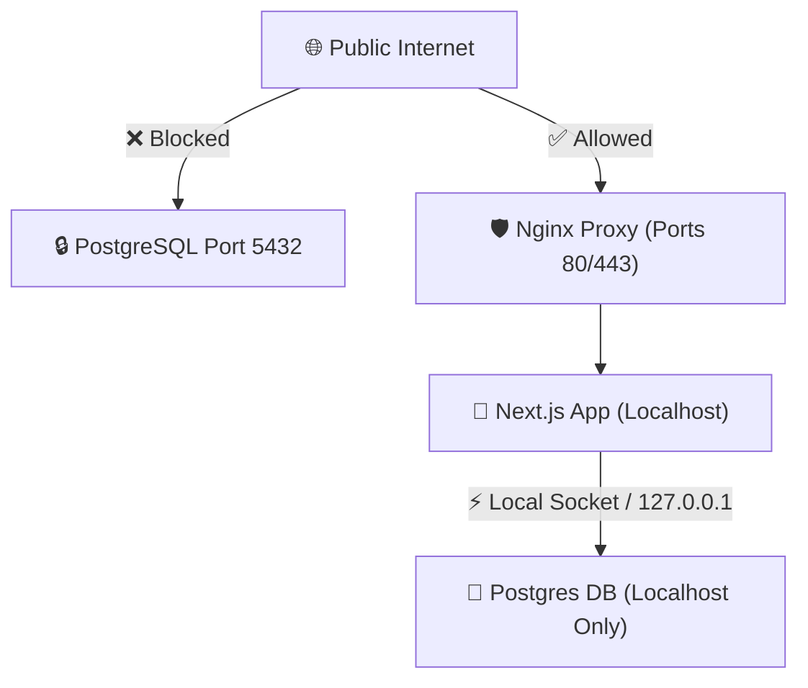

# คู่มือการจัดเตรียมฐานข้อมูล PostgreSQL ให้มีความปลอดภัยสูงสุด (Security Hardening)
## และแนวทางการใช้งาน Docker ในขั้นตอนการพัฒนา (macOS -> Linux VPS)

เอกสารฉบับนี้กำหนดมาตรการและขั้นตอนการตั้งค่า PostgreSQL และสภาพแวดล้อมการพัฒนา เพื่อให้ได้ระบบรับสมัครนักเรียน พสวท. ที่มีเสถียรภาพ ประสิทธิภาพ และระดับความปลอดภัยสูงสุด

---

## 1. การใช้ Docker (Containers) ในขั้นตอนการพัฒนา: ควรใช้หรือไม่?

**คำตอบคือ: ควรใช้เป็นอย่างยิ่งครับ (Highly Recommended)**

เนื่องจากท่านพัฒนาซอฟต์แวร์บนเครื่อง **macOS** แต่เครื่องที่จะนำไปใช้งานจริง (Production Server) เป็นระบบปฏิบัติการ **Linux** การติดตั้ง PostgreSQL ดิบลงบน macOS โดยตรงอาจนำมาซึ่งปัญหา "รันบนเครื่องคนเขียนได้ แต่รันบนเซิร์ฟเวอร์จริงไม่ได้" (Environment Parity mismatch)

### ประโยชน์สำคัญของการใช้ Docker Compose บน macOS ในการพัฒนา:
1.  **จำลองสภาพแวดล้อมได้ใกล้เคียงระบบจริง:** PostgreSQL ที่รันอยู่ใน Docker Container บนเครื่อง macOS จะมีเวอร์ชันและ dependency ใกล้เคียงกับ Linux VPS จริง ลดปัญหา environment mismatch ได้มากกว่าการติดตั้งฐานข้อมูลลง macOS โดยตรง
2.  **จัดการง่ายและสะอาด:** การติดตั้ง PostgreSQL บน macOS ปกติอาจทำให้ไฟล์ขยะเกลื่อนระบบ แต่หากรันผ่าน Docker เราสามารถสั่งเปิด/ปิด หรือล้างข้อมูลทั้งหมดทิ้งเพื่อเริ่มทดสอบใหม่ได้ด้วยคำสั่งเดียวโดยไม่รบกวนระบบหลักของ macOS
3.  **จำลองการแยกเครือข่าย (Network Isolation):** เราสามารถจำลองระบบ Firewall ภายใน Docker Compose เพื่อบังคับให้ตัวแอป Next.js เท่านั้นที่ข้ามฝั่งมาคุยกับฐานข้อมูลได้เลียนแบบระบบจริง

---

## 2. โครงสร้าง Docker Compose สำหรับพัฒนาบนเครื่อง (macOS)

เราจะจัดเตรียมไฟล์ `docker-compose.yml` ในระดับรากของโปรเจกต์ เพื่อรัน PostgreSQL เวอร์ชันเสถียรล่าสุดคู่กับการพัฒนาระบบ:

```yaml
version: '3.8'

services:
  postgres_db:
    image: postgres:16-alpine
    container_name: dpst_postgres_dev
    env_file:
      - .env.docker
    ports:
      - "127.0.0.1:5432:5432" # เปิดเฉพาะเครื่อง local เพื่อเขียนโค้ดและทดสอบ
    volumes:
      - postgres_data:/var/lib/postgresql/data
    networks:
      - dpst_network

volumes:
  postgres_data:

networks:
  dpst_network:
    driver: bridge
```

ตัวอย่างไฟล์ `.env.docker` สำหรับเครื่องพัฒนาเท่านั้น:

```dotenv
POSTGRES_DB=dpst_admission
POSTGRES_USER=dpst_admin
POSTGRES_PASSWORD=change_this_local_development_password
```

ต้องเพิ่ม `.env.docker` และ `.env.local` เข้า `.gitignore` เสมอ เพื่อป้องกันรหัสผ่านหลุดไปกับ source control

---

## 3. ขั้นตอนการตั้งค่า PostgreSQL บนระบบจริง (Linux VPS) ให้ปลอดภัยสูงสุด

เมื่อจะรันฐานข้อมูล PostgreSQL บน Linux VPS จริง เราต้องใช้มาตรการควบคุมความปลอดภัยระดับองค์กร (Enterprise-grade Hardening) ดังต่อไปนี้:



### มาตรการที่ 1: การจำกัดการฟังคำสั่งเฉพาะเครือข่ายภายใน (Network Binding Isolation)
โดยปกติ PostgreSQL อาจพยายามฟังคำสั่งจากภายนอก เราต้องเข้าไปสั่งห้ามเด็ดขาดในไฟล์ตั้งค่าหลักของ PostgreSQL:
*   **ไฟล์แก้ไข:** `/etc/postgresql/16/main/postgresql.conf`
*   **การตั้งค่า:**
    ```ini
    listen_addresses = 'localhost' # หรือ '127.0.0.1'
    ```
    *ผลลัพธ์:* ฐานข้อมูลจะเพิกเฉยต่อการเรียกใช้จากอินเทอร์เน็ตภายนอกโดยสิ้นเชิง และจะคุยเฉพาะกับซอฟต์แวร์ที่รันอยู่ข้างในเครื่อง VPS เดียวกันเท่านั้น (Next.js)

---

### มาตรการที่ 2: ตั้งค่ากฎการเข้าถึงข้อมูลที่เข้มงวดสูงสุด (Strict HBA Policy)
กำหนดในไฟล์ควบคุมการระบุตัวตนของการเข้าถึง เพื่อยอมรับการเชื่อมต่อเฉพาะที่มีการยืนยันตัวตนระดับสูง
*   **ไฟล์แก้ไข:** `/etc/postgresql/16/main/pg_hba.conf`
*   **การกำหนดค่าที่ปลอดภัยสูงสุด:**
    ```text
    # TYPE  DATABASE        USER            ADDRESS                 METHOD
    
    # สำหรับแอดมินระบบหลักของลินุกซ์ที่ล็อกอินภายในเครื่อง
    local   all             postgres                                peer
    
    # สำหรับแอปพลิเคชันรับสมัครนักเรียน (Next.js) เชื่อมต่อผ่าน Localhost เท่านั้น
    host    dpst_admission  dpst_app_user   127.0.0.1/32            scram-sha-256
    host    dpst_admission  dpst_app_user   ::1/128                 scram-sha-256
    
    # ปฏิเสธการเข้าถึงอื่นๆ ทั้งหมดโดยสิ้นเชิง (Implicit Deny All)
    ```
    *คำอธิบาย:* 
    *   **scram-sha-256** เป็นอัลกอริทึมการแฮชรหัสผ่านที่ปลอดภัยที่สุดในปัจจุบัน ป้องกันภัยจากการดักฟังและพยายามเจาะถอดรหัส
    *   ห้ามเปิดรับการเชื่อมต่อแบบไร้รหัสผ่าน (`trust`) เป็นอันขาด

---

### มาตรการที่ 3: การจำกัดสิทธิ์ผู้ใช้ฐานข้อมูล (Least Privilege Principle)
แอปพลิเคชัน Next.js **ห้ามใช้งานผู้ใช้ `postgres` (Superuser) ในการบันทึกข้อมูลเด็ดขาด** เพื่อจำกัดความเสียหายหากแอปถูกบุกรุก ให้แยกผู้ใช้งานฐานข้อมูลอย่างน้อย 2 ระดับ:

1.  **Migration/Admin User:** ใช้เฉพาะตอน deploy หรือรัน migration เท่านั้น มีสิทธิ์แก้ schema
2.  **Runtime App User:** ใช้โดย Next.js ระหว่างให้บริการจริง มีสิทธิ์เฉพาะอ่าน/เพิ่ม/แก้ไขข้อมูลในตารางที่จำเป็น และไม่ใช้สิทธิ์ลบข้อมูลสมัครโดยตรง

สร้างฐานข้อมูลและผู้ใช้เฉพาะงาน:

```sql
CREATE DATABASE dpst_admission;
CREATE USER dpst_migration_user WITH PASSWORD 'รหัสผ่านยากๆความยาว_32_ตัวอักษรขึ้นไป';
CREATE USER dpst_app_user WITH PASSWORD 'รหัสผ่านยากๆความยาว_32_ตัวอักษรขึ้นไป';
```

มอบสิทธิ์ runtime เฉพาะที่จำเป็น:

```sql
GRANT CONNECT ON DATABASE dpst_admission TO dpst_app_user;
GRANT USAGE ON SCHEMA public TO dpst_app_user;
-- ใช้ soft delete/status transition แทนการลบใบสมัครจริง
GRANT SELECT, INSERT, UPDATE ON ALL TABLES IN SCHEMA public TO dpst_app_user;
GRANT USAGE, SELECT ON ALL SEQUENCES IN SCHEMA public TO dpst_app_user;
```

สำหรับข้อมูลใบสมัครและเอกสารแนบ ให้ใช้สถานะ เช่น `draft`, `submitted`, `approved`, `rejected`, `frozen` หรือ flag ที่เหมาะสมแทนการ `DELETE` เพื่อให้ข้อมูลที่ใช้ตรวจสอบและ export ไม่หายโดยไม่ตั้งใจ

---

### มาตรการที่ 4: การรักษาความปลอดภัยในการเก็บรหัสผ่านระบบเชื่อมต่อ (Environment Variables)
*   ห้ามเขียนรหัสผ่านฐานข้อมูลลงในเนื้อโค้ดที่อัปโหลดขึ้น GitHub เด็ดขาด
*   ให้บันทึกคำสั่งต่อเชื่อมไว้ในไฟล์ชื่อ `.env.local`
*   บนเครื่องเซิร์ฟเวอร์จริง ให้ปรับตั้งค่าสิทธิ์เข้าถึงไฟล์เก็บค่าตัวแปรนี้ให้เป็นแบบอ่านได้เฉพาะยูสเซอร์ที่เปิดเว็บเท่านั้น:
    ```bash
    chmod 600 .env.local
    ```

---

### มาตรการที่ 5: ระบบสำรองข้อมูลที่เข้ารหัสอัตโนมัติ (Encrypted Automated Backups)
เนื่องจากระบบเป็น self-hosted เราจะตั้งสคริปต์สำรองข้อมูลอัตโนมัติทุกๆ คืนเวลา 02:00 น. โดยทำการบันทึกข้อมูล รวบรวมไฟล์อัปโหลด ทำการเข้ารหัสไฟล์บีบอัด แล้วส่งขึ้นไปยังบัญชีเก็บข้อมูลส่วนตัวของโรงเรียน (เช่น Google Drive, OneDrive)

### มาตรการที่ 6: Private Upload Directory และ File Gateway
ไฟล์รูปถ่าย, ปพ.1 และบัตรประชาชนต้องถูกเก็บในไดเรกทอรีที่อยู่นอกโฟลเดอร์ public ของ Next.js เช่น `/var/lib/dpst-admission/uploads` และกำหนดสิทธิ์ไฟล์ให้ user ที่รันแอปอ่านได้เท่านั้น

การเปิดไฟล์ให้เจ้าหน้าที่ดูต้องผ่าน Next.js Route Handler ที่ตรวจสอบ session และ role ก่อน stream ไฟล์กลับไปยัง browser ห้ามสร้าง URL ที่ชี้ path จริงของไฟล์บนดิสก์ และควรตั้งค่า response header เช่น `Cache-Control: private, no-store` สำหรับเอกสารส่วนบุคคล
