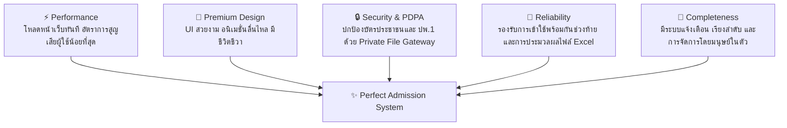
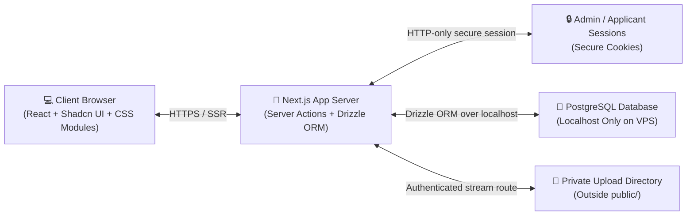

# เอกสารข้อเสนอและวิเคราะห์สถาปัตยกรรมเทคโนโลยี (Technology Stack Specification)
## ระบบรับสมัครนักเรียนเข้าโครงการ พสวท. สู่ความเป็นเลิศ ศูนย์โรงเรียนเบญจมราชูทิศ

เอกสารฉบับนี้วิเคราะห์และเสนอแนะทางเลือกสถาปัตยกรรมเทคโนโลยี (Tech Stack) ในการพัฒนาระบบรับสมัครนักเรียน โดยมุ่งเน้นไปที่เกณฑ์สำคัญ 5 ประการ ได้แก่ **ความสมบูรณ์แบบในการทำงาน (Completeness), ประสิทธิภาพการประมวลผลสูง (Performance), การออกแบบประสบการณ์ระดับพรีเมียม (Premium Design & Micro-interactions), ความน่าเชื่อถือของระบบข้อมูล (High Reliability), และความปลอดภัยของข้อมูลส่วนบุคคลขั้นสูง (PDPA Compliant & Enterprise Security)**

---

## 1. เกณฑ์การคัดเลือกสถาปัตยกรรม (Selection & Evaluation Pillars)

ในการเลือกเทคโนโลยี ระบบนี้มีเงื่อนไขจำเพาะที่ต้องการการตอบสนองที่โดดเด่นใน 5 เสาหลัก:

---

## 2. สถาปัตยกรรมระบบที่เลือกใช้งาน (Selected Tech Stack)

**Next.js (React 19) + Self-Hosted PostgreSQL on Linux VPS + Shadcn UI & CSS Modules**
*โครงสร้างแบบ VPS-hosted full-stack ที่มีความปลอดภัย ประสิทธิภาพ ต้นทุนคงที่ และควบคุมข้อมูลส่วนบุคคลได้ครบถ้วน*

สถาปัตยกรรมนี้รัน Next.js และ PostgreSQL บน Linux VPS เครื่องเดียวกัน ฐานข้อมูลเชื่อมต่อผ่าน `localhost` เพื่อลด latency และไฟล์แนบถูกเก็บใน private directory ที่ไม่ถูกเสิร์ฟจากเว็บโดยตรง การเปิดดูเอกสารของเจ้าหน้าที่ต้องผ่าน authenticated file gateway ของ Next.js เท่านั้น

### ส่วนประกอบทางเทคโนโลยีอย่างเป็นทางการ (Official Tech Matrix)

1.  **Frontend & Backend-for-Frontend (BFF): Next.js (App Router, React 19)**
    *   **ประสิทธิภาพ:** รองรับ Server-Side Rendering (SSR) ทำให้โหลดหน้าสมัครครั้งแรกได้ทันที และย้ายกระบวนการคำนวณเกรดที่ซับซ้อนไปทำบน Server เพื่อป้องกันการดัดแปลงแก้ไขข้อมูล (Data Manipulation) จากเบราว์เซอร์ของผู้ใช้
2.  **เครื่องมือจัดแต่งสไตล์และการออกแบบ (Styling & Design System):**
    *   **CSS Modules:** การเขียน Vanilla CSS แยกเป็นไฟล์ย่อยจำเพาะสำหรับแต่ละ Component ข้อดีคือใช้งานง่าย เป็นระเบียบ ไม่เกิดปัญหาชื่อคลาสชนกัน และโหลดได้เร็วที่สุดเพราะไม่ต้องประมวลผลเพิ่มที่เบราว์เซอร์
    *   **Shadcn UI ร่วมกับ Tailwind CSS:** ระบบสร้าง UI Component สำเร็จรูปแบบพรีเมียม (เช่น ตาราง, กล่องแจ้งเตือน, ปฏิทิน) ที่มีความเป็นระเบียบสูงมาก ปรับแต่งหน้าตาได้ตามชอบ และเป็นมาตรฐานสากล
3.  **ระบบจัดการฐานข้อมูล (Database & Infrastructure): Self-Hosted PostgreSQL on VPS**
    *   **Self-Hosted PostgreSQL + Next.js บน Linux VPS (จ่ายคงที่ประมาณ 150-300 บาท/เดือน):** เช่าเซิร์ฟเวอร์ VPS (เช่น DigitalOcean, Hetzner, หรือผู้ให้บริการในไทย) รันฐานข้อมูล PostgreSQL ร่วมกับแอป Next.js บนเครื่องเดียวกัน 
        *   *ประสิทธิภาพ (Performance):* **สูงที่สุด** เนื่องจากฐานข้อมูลและแอปเชื่อมต่อผ่าน `localhost` (0ms Network Latency)
        *   *ความปลอดภัย (Security):* ปรับตั้งค่า Firewall ปิดพอร์ตฐานข้อมูลจากภายนอก รัน SSL/TLS ผ่าน HTTPS และเขียนระบบบันทึกไฟล์อัปโหลดลงในโฟลเดอร์ส่วนตัวบน VPS (Private Storage) ที่เข้าถึงได้เฉพาะแอดมินที่ล็อกอินผ่าน API เท่านั้น
4.  **ระบบจัดเก็บไฟล์รูปถ่าย ปพ.1 และบัตรประชาชน (PDPA Secure Storage):**
    *   **บน VPS (Self-Hosted):** เก็บใน Direct Private Directory บน Linux Disk ที่อยู่นอก `public/` และเขียน Next.js Route Handlers ทำหน้าที่เป็น Gateway อ่านข้อมูลส่งกลับผ่านสตรีมเฉพาะเจ้าหน้าที่ตรวจสอบ ต้องไม่เปิดเผย path จริงของไฟล์ และต้องตั้ง cache header ให้เหมาะสมกับข้อมูลส่วนบุคคล

---

## 3. เครื่องมือเสริมเพื่อเพิ่มคุณภาพและความรวดเร็วในการพัฒนา (Quality & Testing Stack)

เพื่อช่วยให้การทำโปรเจกต์มีความถูกต้อง แม่นยำ และมีคุณภาพสูงสุด เราได้ผนวกเครื่องมือควบคุมคุณภาพดังต่อไปนี้เข้าสู่สถาปัตยกรรมหลัก:

*   **1. เครื่องมือตรวจสอบความถูกต้องของข้อมูล (Schema Validation): Zod**
    *   *ประโยชน์:* ทำหน้าที่ตรวจสอบรูปแบบข้อมูลทั้งหมดที่ฝั่งเบราว์เซอร์และเซิร์ฟเวอร์ก่อนบันทึก เช่น การตรวจสอบว่าเลขประจำตัวประชาชนต้องครบ 13 หลักพอดี หรือผลการเรียนต้องอยู่ระหว่าง `0.00` ถึง `4.00` เท่านั้น
*   **2. ตัวเชื่อมต่อฐานข้อมูลที่มีระบบ Type-Safety สูงสุด: Drizzle ORM**
    *   *ประโยชน์:* ช่วยให้ผู้พัฒนาเขียนโค้ดภาษา TypeScript เพื่อดึงหรือบันทึกข้อมูลแทนการเขียนคำสั่ง SQL ดิบ ช่วยป้องกันข้อผิดพลาดในการสะกดชื่อคอลัมน์ในฐานข้อมูล (Compile-time Type Safety)
*   **3. ระบบทดสอบหน่วยการทำงาน (Unit Testing Engine): Vitest**
    *   *ประโยชน์:* เครื่องมือทดสอบความถูกต้องที่รวดเร็วมาก เหมาะสำหรับเขียนสคริปต์เพื่อ **ทดสอบสูตรการคำนวณเกรดเฉลี่ยสะสม 5 เทอม** ในทุกเงื่อนไขที่เป็นไปได้ เพื่อรับประกันความถูกต้องแม่นยำว่าระบบจะไม่มีวันปัดทศนิยมผิดพลาด
*   **4. เครื่องมือควบคุมคุณภาพและรูปแบบโค้ด (Linting & Formatting): ESLint + Prettier**
    *   *ประโยชน์:* บังคับให้โครงสร้างโค้ดมีความเรียบร้อย สะอาด สวยงาม และตรวจสอบหา Bug เบื้องต้นในโค้ดก่อนทำการรันจริง

## 4. ข้อสรุปและการตัดสินใจเลือกสถาปัตยกรรม (Finalized Architecture Specification)

ระบบรับสมัครนักเรียน พสวท. โรงเรียนเบญจมราชูทิศ ได้ข้อสรุปการเลือกเทคโนโลยีและแนวทางการติดตั้งอย่างเป็นทางการเพื่อตอบโจทย์ **"ประสิทธิภาพสูงสุด ความปลอดภัยสูงสุด และประหยัดค่าใช้จ่ายระยะยาว"** ดังนี้:

### สถาปัตยกรรมหลักของระบบ (Core Architecture Stack)
*   **สไตล์และการออกแบบ UI:** **Shadcn UI** (สำหรับโมเดิร์นปุ่ม คอมโพเนนท์พื้นฐาน) ร่วมกับ **CSS Modules** (สำหรับฟอร์มกรอกเกรดและเลย์เอาต์พิเศษ) เพื่อความสะอาด เป็นระเบียบเรียบร้อย และไม่มีสไตล์ปนเปื้อน
*   **เฟรมเวิร์กหลัก:** **Next.js 15+ (React 19)** รันการคำนวณและประมวลผลเกรดสะสม 5 เทอมที่ฝั่ง Server-Side (Server Actions) ป้องกันผู้สมัครแก้ไขเกรดบนเบราว์เซอร์
*   **ฐานข้อมูลหลัก (Production):** **PostgreSQL (Self-Hosted on Linux VPS)** ติดตั้งและควบคุมในเซิร์ฟเวอร์เดียวกับแอปพลิเคชัน
*   **สภาพแวดล้อมการพัฒนา (Development on macOS):** **Docker Compose (Postgres Container)** เพื่อให้เวอร์ชันและพฤติกรรมฐานข้อมูลใกล้เคียง Production บน Linux VPS และสะดวกต่อการเริ่มระบบทดสอบ
*   **ตัวเชื่อมฐานข้อมูล:** **Drizzle ORM** เขียนคำสั่งประมวลผลดึงและบันทึกฐานข้อมูลแบบ Type-Safety ป้องกันข้อผิดพลาดในการสะกดคอลัมน์ตั้งแต่ขั้นตอนการพัฒนา

### ชุดเครื่องมือเสริมคุณภาพและความปลอดภัย (Security & Quality Assurance Stack)
*   **เครื่องมือตรวจกรองอินพุต:** **Zod** สกัดกั้นข้อมูลที่ไม่ถูกต้อง (เช่น เกรดอยู่นอกช่วง 0-4, เลขบัตรประชาชนไม่ครบ 13 หลัก) ทันทีก่อนเขียนลงดิสก์
*   **เครื่องมือทดสอบสมการคำนวณ (Unit Test):** **Vitest** เขียนโปรแกรมตรวจสอบสูตรเกรดเฉลี่ยสะสมถ่วงน้ำหนักหน่วยกิตในทุกกรณีที่เป็นไปได้ ป้องกันข้อผิดพลาดจากการปัดเศษทศนิยม
*   **เครื่องมือจำลองพฤติกรรมผู้ใช้จริง (E2E Test):** **Playwright** เปิดเบราว์เซอร์เสมือนเพื่อกรอกข้อมูลใบสมัคร ทดสอบการแสดงผลและไฟแจ้งเตือนความผิดพลาดสีแดง/เขียวของรหัสวิชาพื้นฐานบนอุปกรณ์ Safari และ Chrome ของเด็ก
*   **ระบบความปลอดภัยไฟล์ส่วนบุคคล (PDPA Storage Gateway):** จัดเก็บรูปถ่ายเครื่องแบบและรูป ปพ.1 ลงในไดเรกทอรีส่วนตัวบน Linux VPS (Private Directory) และพัฒนา Next.js Route Handlers ทำหน้าที่เป็น Gateway ยืนยันตัวตนตรวจสอบสิทธิ์ของเจ้าหน้าที่ก่อนดึงไฟล์รูปออกแสดงผล
*   **ขั้นตอนหลังปิดรับสมัครแบบ Manual Control:** การปิดรับสมัคร lock edit, ranking และ export ต้องเป็นปุ่มแยกในหน้า Admin เพื่อให้เจ้าหน้าที่ควบคุมจังหวะการทำงานเองทั้งหมด

### การประเมินมิติความคุ้มค่าและความปลอดภัยหลังการปรับแต่ง

| มิติการพิจารณา | สถาปัตยกรรมที่เลือกใช้งานจริง (Next.js + Self-Hosted PostgreSQL on VPS) |
| :--- | :--- |
| **ประสิทธิภาพ (Performance)** | 🌟 **ยอดเยี่ยมที่สุด** (รัน App และ Database ร่วมกันบนเครื่องเดียวกัน ส่งข้อมูลผ่าน localhost มี Latency ใกล้เคียง 0ms) |
| **ความมั่นคงปลอดภัย (Security)** | 🌟 **ยอดเยี่ยมและควบคุมได้เบ็ดเสร็จ** (ปิดพอร์ต 5432 จากสาธารณะ, คุยเฉพาะเครือข่ายภายใน, และเก็บไฟล์อัปโหลดใน Private Directory ล็อกด้วย Next.js Server API) |
| **ค่าใช้จ่ายรายเดือน (Cost)** | 🌟 **ประหยัดและคาดการณ์ได้ง่าย** (จ่ายค่าเช่า VPS ประมาณ 150-300 บาท/เดือนตามผู้ให้บริการและแพ็กเกจที่เลือก) |
| **ความแม่นยำและการป้องกันข้อผิดพลาด** | 🌟 **ยอดเยี่ยมด้วยระบบตรวจอัตโนมัติ** (ใช้ Zod กรองอินพุต, ใช้ Drizzle ตรวจไทป์ตัวแปร, และใช้ Vitest ตรวจสอบการปัดเศษเกรดถ่วงน้ำหนัก) |
| **ความเข้ากันได้ของการทำงาน (Dev vs Prod)** | 🌟 **ยอดเยี่ยมและเป็นระเบียบ** (ใช้ Docker รัน Postgres บน macOS ทำให้ได้ Database เวอร์ชันเดียวกับ Linux VPS และลดความต่างของสภาพแวดล้อม) |
